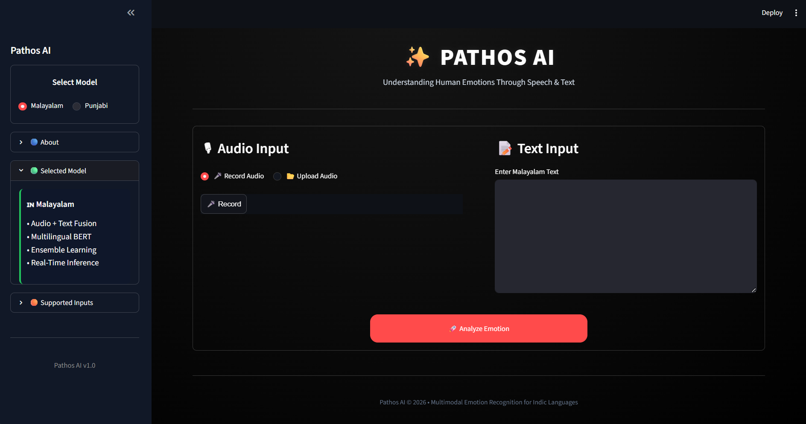
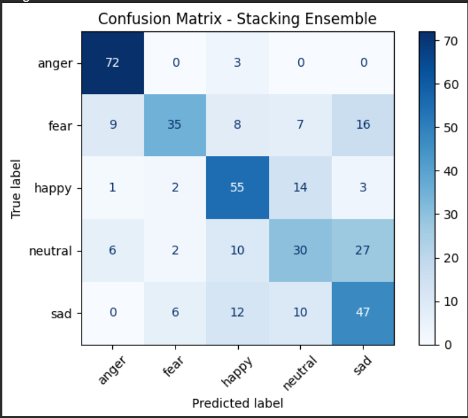

<div align="center">

# ✨ Pathos AI: Multimodal Emotion Recognition for Indic Languages


**Pathos AI** is a multimodal emotion recognition framework engineered to provide inclusive, emotion-aware AI for Indic languages. By fusing high-fidelity acoustic signal processing with semantic transformer-based embeddings, the platform enables precise emotional state classification in **Malayalam** and **Punjabi**.

**[GitHub Repository](https://github.com/KKaur170/Pathos-AI)**

<br>

*(Dashboard Overview)*


</div>

---

## 🔬 Engineering Highlights

### 1. Distinct Pipeline Architectures
Pathos AI employs two specialized processing engines based on the specific linguistic and data needs of each language:

* **Malayalam (Multimodal):** Implements a **Voting Ensemble** (LightGBM, XGBoost, Random Forest). It fuses spectral acoustic features (`MFCC`, `Chroma`) with 384-dimensional semantic embeddings from `bert-base-multilingual-cased`.
* **Punjabi (Acoustic-Prosodic):** Implements a **Stacking Ensemble** (LightGBM, CatBoost, Random Forest). It focuses on fine-grained phonatory metrics—specifically `F0` (pitch), `Jitter`, `Shimmer`, and `HNR`—extracted via `Praat/Parselmouth`.

### 2. Decision Engine & Robustness
* **Margin-Based Thresholding:** Unlike standard `argmax` classifiers prone to error in imbalanced scenarios, our custom `apply_margin_logic` evaluates prediction confidence against dynamic thresholds:
    `margin = probability - threshold`
    Labels are only accepted if they meet the margin requirement, significantly reducing misclassifications in low-confidence samples.
* **Feature Optimization:** We utilize **LGBM-based feature importance mapping** to retain only the most discriminative audio metrics, ensuring low-latency inference during real-time use.


---

## 📊 Performance Insights

| Pipeline | Model Architecture | Validation Accuracy |
| :--- | :--- | :---: |
| **Malayalam** | Voting Ensemble (Soft-Voting) | 85.1% |
| **Punjabi** | Stacking Ensemble (LGBM meta-learner) | 82.5% |

<br>

<div align="center">
  
  
</div>

---

## 🚀 Setup & Usage

### 1. Requirements
Ensure you have `ffmpeg` installed on your system for audio processing capabilities.

### 2. Installation
```bash
git clone [https://github.com/KKaur170/Pathos-AI.git](https://github.com/KKaur170/Pathos-AI.git)
cd Pathos-AI
pip install -r requirements.txt
```

### 3. Launch the Application
```bash
streamlit run src/app.py
```

---

## 📂 Repository Structure

